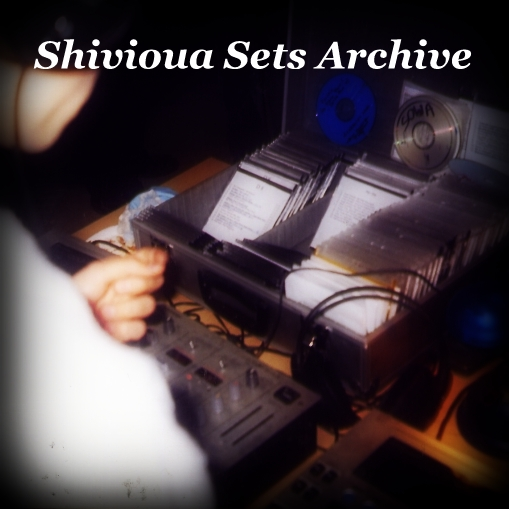

# All Sets (DJ Mixes)

Order by - [Newest](./all-sets.md) :: **[Top Listens](./all-sets-sorted.md)**
 
* [Poljica (August 2023)](https://shivioua.github.io/progressive-awake/poljica-august-2023.html) _//_ 567🎧
* [Snowdrop (March 2011)](https://shivioua.github.io/progressive-awake/snowdrop-march-2011.html) _//_ 538🎧
* [First Snow (November 2010)](https://shivioua.github.io/progressive-awake/first-snow-november-2010.html) _//_ 473🎧
* [Winylowa Kanciapa #66 (June 2021)](https://shivioua.github.io/fresh-dance-music/winylowa-kanciapa-66-june-2021.html) _//_ 443🎧
* [Hard days at work (April 2009)](https://shivioua.github.io/progressive-awake/hard-days-at-work-april-2009.html) _//_ 348🎧
* [Winylowa Kanciapa #96 (February 2022)](https://shivioua.github.io/progressive-awake/winylowa-kanciapa-96-february-2022.html) _//_ 319🎧
* [Just fly with me (December 2008)](https://shivioua.github.io/progressive-awake/just-fly-with-me-december-2008.html) _//_ 257🎧
* [When I am overtaken by... (April 2009)](https://shivioua.github.io/progressive-awake/when-i-am-overtaken-by-april-2009.html) _//_ 255🎧
* [Spring is in the air (March 2014)](https://shivioua.github.io/progressive-awake/spring-is-in-the-air-march-2014.html) _//_ 221🎧
* [**Rolls & Bass (December 2025)**](https://shivioua.github.io/quantum-energy/rolls-and-bass-december-2025.html) _//_ 201🎧
* [Primrose (April 2008)](https://shivioua.github.io/fresh-dance-music/primrose-april-2008.html) _//_ 190🎧
* [Backstreet Bar (August 2024)](https://shivioua.github.io/progressive-awake/backstreet-bar-august-2024.html) _//_ 129🎧
* [Nothing (January 2009)](https://shivioua.github.io/progressive-awake/nothing-january-2009.html) _//_ 127🎧
* [It’s in my soul (June 2008)](https://shivioua.github.io/progressive-awake/its-in-my-soul-june-2008.html) _//_ 117🎧
* [Lobotomia (June 2009)](https://shivioua.github.io/progressive-awake/lobotomia-june-2009.html) _//_ 110🎧
* [Discovering myself with You (March 2009)](https://shivioua.github.io/progressive-awake/discovering-myself-with-you-march-2009.html) _//_ 101🎧
* [Playpool (September 2016)](https://shivioua.github.io/progressive-awake/playpool-september-2016.html) _//_ 89🎧
* [Sweet candies (March 2009)](https://shivioua.github.io/progressive-awake/sweet-candies-march-2009.html) _//_ 77🎧
* [Love Paradox (August 2008)](https://shivioua.github.io/progressive-awake/love-paradox-august-2008.html) _//_ 72🎧
* [Love Cycle (February 2011)](https://shivioua.github.io/quantum-energy/love-cycle-february-2011.html) _//_ 66🎧
* [The Blue Oyster (January 2021)](https://shivioua.github.io/progressive-awake/the-blue-oyster-january-2021.html) _//_ 63🎧
* [It’s in my soul 2 (July 2008)](https://shivioua.github.io/progressive-awake/its-in-my-soul-2-july-2008.html) _//_ 62🎧
* [Hypnotized By Your Light (February 2021)](https://shivioua.github.io/progressive-awake/hypnotized-by-your-light-february-2021.html) _//_ 62🎧
* [Midgard (May 2009)](https://shivioua.github.io/progressive-awake/midgard-may-2009.html) _//_ 58🎧
* [Cave (January 2015)](https://shivioua.github.io/fresh-dance-music/cave-january-2015.html) _//_ 52🎧
* [Deanery No. 161 (May 2014)](https://shivioua.github.io/fresh-dance-music/deanery-no-161-may-2014.html) _//_ 52🎧
* [Freedom (October 2025)](https://shivioua.github.io/fresh-dance-music/freedom-october-2025.html) _//_ 50🎧
* [Two Hearts (August 2018)](https://shivioua.github.io/quantum-energy/two-hearts__august-2018.html) _//_ 48🎧
* [Different Kind Of Life (October 2012)](https://shivioua.github.io/progressive-awake/different-kind-of-life-october-2012.html) _//_ 47🎧
* [Somebody New (November 2015)](https://shivioua.github.io/fresh-dance-music/somebody-new-november-2015.html) _//_ 42🎧
* [Uncharted Waters (June 2015)](https://shivioua.github.io/progressive-awake/uncharted-waters-june-2015.html) _//_ 41🎧
* [New Time, New Place (June 2018)](https://shivioua.github.io/progressive-awake/new-time-new-place-june-2018.html) _//_ 33🎧
* [Winter solstice (December 2012)](https://shivioua.github.io/quantum-energy/winter-solstice-december-2012.html) _//_ 30🎧
* [Beachball (July 2018)](https://shivioua.github.io/fresh-dance-music/beachball-july-2018.html) _//_ 29🎧
* [Still Waters Run Deep (December 2010)](https://shivioua.github.io/quantum-energy/still-waters-run-deep-december-2010.html) _//_ 29🎧
* [Lullaby (December 2021)](https://shivioua.github.io/progressive-awake/lullaby-december-2021.html) _//_ 28🎧
* [Lick The Groove (May 2021)](https://shivioua.github.io/quantum-energy/lick-the-groove-may-2010.html) _//_ 23🎧
* [Bit Harder (April 2021)](https://shivioua.github.io/progressive-awake/bit-harder-april-2021.html) _//_ 19🎧
* [Rebalancing (December 2022)](https://shivioua.github.io/progressive-awake/rebalancing-december-2022.html) _//_ 19🎧
* [Everyday Something New (November 2011)](https://shivioua.github.io/quantum-energy/everyday-something-new-november-2011.html) _//_ 17🎧
* [4 Seasons Of Love (November 2009)](https://shivioua.github.io/progressive-awake/4-seasons-of-love-november-2009.html) _//_ 16🎧
* [Rzepedka (April 2021)](https://shivioua.github.io/fresh-dance-music/rzepedka-april-2021.html) _//_ 16🎧
* [Modern Rock & Roll (July 2021)](https://shivioua.github.io/quantum-energy/modern-rock-and-roll-july-2021.html) _//_ 16🎧
* [Somebody New Vol. 3 (November 2021)](https://shivioua.github.io/progressive-awake/somebody-new-vol-3-november-2021.html) _//_ 16🎧
* [Counter Plus Plus (March 2021)](https://shivioua.github.io/quantum-energy/counter-plus-plus-march-2021.html) _//_ 15🎧
* [New Time, Same Place (August 2021)](https://shivioua.github.io/fresh-dance-music/new-time-same-place-august-2021.html) _//_ 15🎧
* [Lost in You, lost myself… (October 2009)](https://shivioua.github.io/progressive-awake/lost-in-you-lost-myself-october-2009.html) _//_ 15🎧
* [7 months of dream (July 2009)](https://shivioua.github.io/progressive-awake/7-months-of-dream-dont-want-to-wake-up-july-2009.html) _//_ 14🎧
* [La Playa (July 2020)](https://shivioua.github.io/progressive-awake/la-playa-july-2020.html) _//_ 14🎧
* [House Sweet House (March 2010)](https://shivioua.github.io/fresh-dance-music/house-sweet-house-march-2010.html) _//_ 13🎧
* [Ungovernable Appetence (September 2009)](https://shivioua.github.io/progressive-awake/ungovernable-appetence-september-2009.html) _//_ 13🎧
* [Chillstep (June 2011)](https://shivioua.github.io/quantum-energy/chillstep-june-2011.html) _//_ 12🎧
* [Reminiscence (August 2011)](https://shivioua.github.io/progressive-awake/reminiscence-august-2011.html) _//_ 11🎧
* [Faixa Azul (June 2023)](https://shivioua.github.io/progressive-awake/faixa-azul-august-2023.html) _//_ 10🎧
* [Music Is My Oxygen (January 2010)](https://shivioua.github.io/progressive-awake/music-is-my-oxygen-january-2010.html) _//_ 10🎧
* [Knockout (March 2011)](https://shivioua.github.io/fresh-dance-music/knockout-march-2011.html) _//_ 8🎧
* [For An Angel (January 2010)](https://shivioua.github.io/fresh-dance-music/for-an-angel-january-2010.html) _//_ 8🎧
* [Vinylegg (August 2020)](https://shivioua.github.io/quantum-energy/vinylegg-april-2020.html) _//_ 8🎧
* [Doubtfulness Waves (September 2009)](https://shivioua.github.io/progressive-awake/doubtfulness-waves-september-2009.html) _//_ 7🎧
* [Opium (July 2009)](https://shivioua.github.io/progressive-awake/opium-july-2009.html) _//_ 4🎧
* [Effervescence (June 2009)](https://shivioua.github.io/progressive-awake/effervescence-june-2009.html) _//_ 4🎧
* [Tribute to CDQ Burakowska (April 2021)](https://shivioua.github.io/quantum-energy/tribute-to-cdq-burakowska-april-2021.html) _//_ 2🎧

Total plays: **5.8k🎧**  
Total amount of sets: **62🎶**  

Thank you for listening 😍

----

[Back to main page](https://shivioua.github.io)

----
